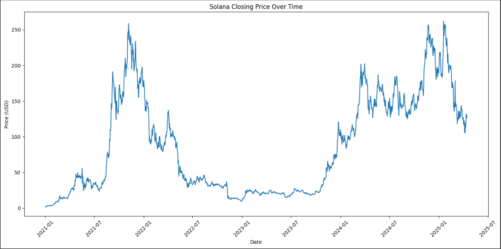
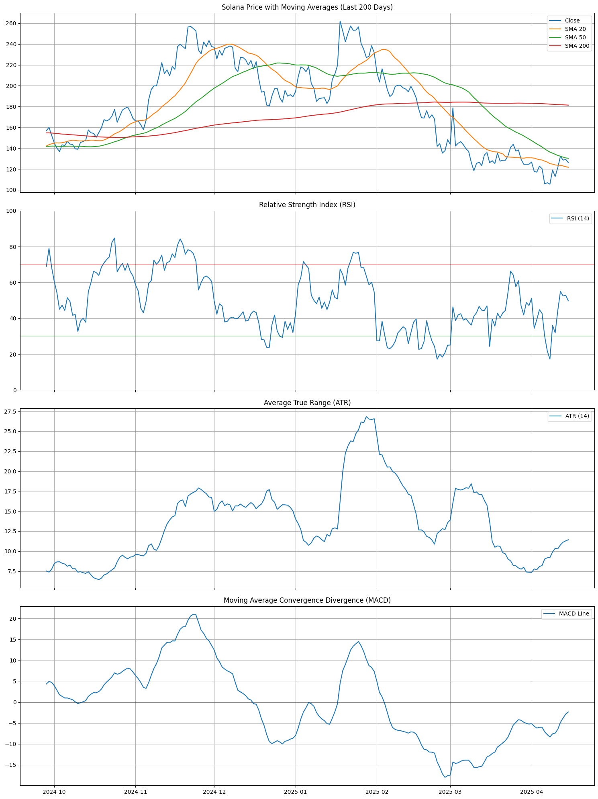
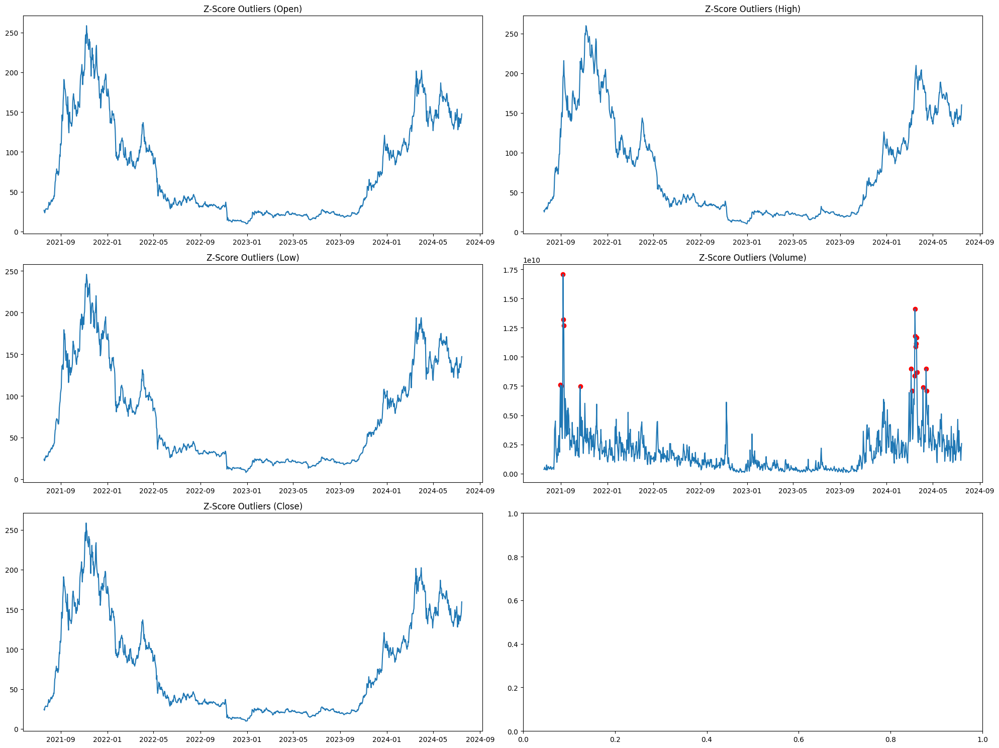
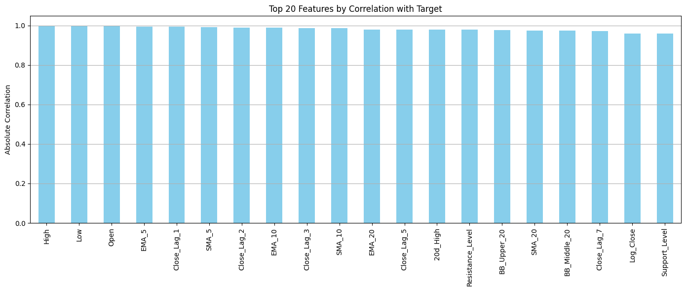
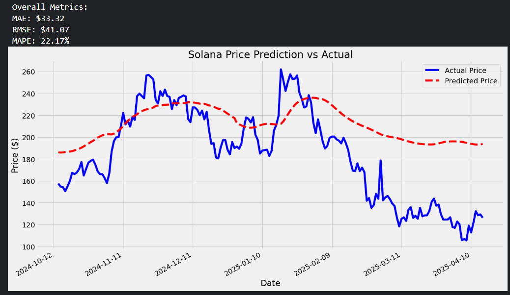
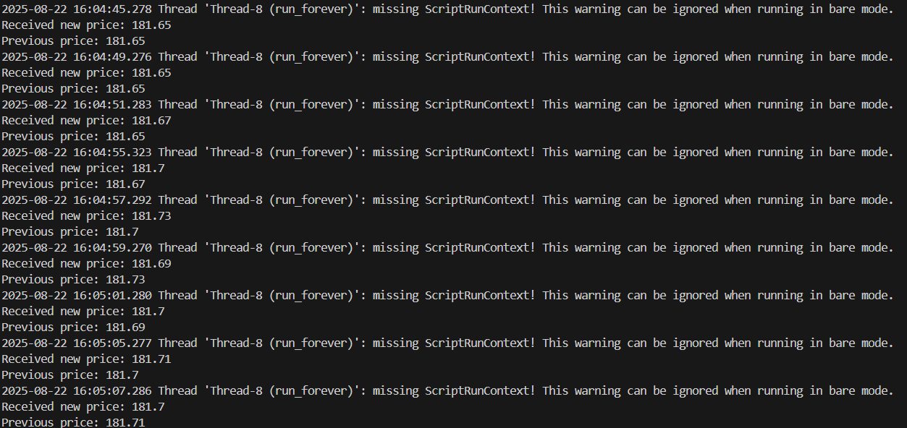
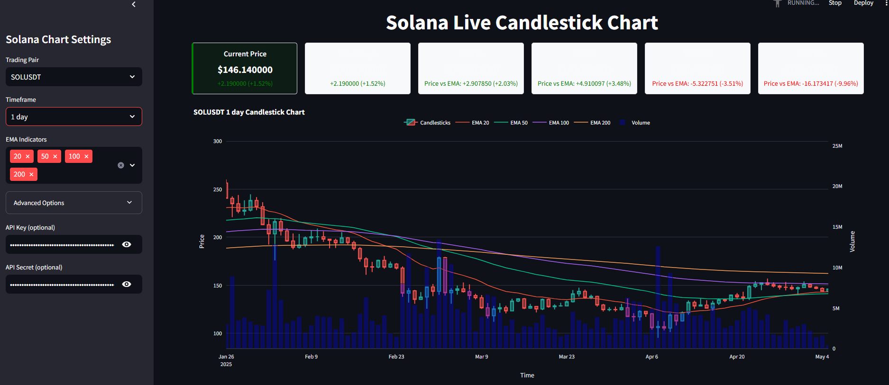

# Solana Price Data Analysis Repository

This repository contains a comprehensive analysis of Solana price data collected from **01-01-2021** to **29-09-2024** in OHLCV format. The project demonstrates the process of fetching raw data, adding technical indicators, performing data cleaning, feature engineering, and preprocessing to ultimately generate an enhanced dataset with **44 columns**.

---

## Repository Structure

- **Datasets:**
  - `solana_price_dataset.csv`  
    *The original OHLCV dataset containing basic open, high, low, close, and volume data.*
  - `solana_price_dataset_with_indicators.csv`  
    *The dataset after technical indicators have been added using the `ta` library.*

- **Notebooks:**
  - `add_indicators.ipynb`  
    *Jupyter Notebook for fetching the OHLCV data and adding technical indicators.*
  - `data_analysis.ipynb`  
    *Jupyter Notebook for performing data cleaning, feature engineering, and preprocessing.*
  - `crypto-prediction.ipynb`  
    *Notebook for training a model to predict Solana price based on historical data.*
  - `Cypto_data_processing_v3.ipynb`  
    *Complete end-to-end data pipeline: ingestion, cleaning, merging, and feature engineering for Solana data.*
  - `live-dashboard.py`  
    *Python script for a real-time Solana price dashboard using Binance API.*


- **Figures:**
  - `./images/solana_price_chart.png`  
    *A sample visualization of the Solana price data with added indicators.*
  - `./images/live_dashboard.png`  
    *Screenshot of the real-time Solana price dashboard using Binance API.*
  - `./images/terminal_output.png`  
    *Terminal output showcasing the successful execution of data pipeline scripts.*
  - `./images/solana_prediction_vs_actual.png`  
    *Visualization comparing actual vs predicted Solana prices, with MAE, RMSE, and MAPE metrics.*


---

## Notebooks Overview

### add_indicators.ipynb

- **Purpose:**  
  This notebook demonstrates how to:
  - Fetch Solana price data in OHLCV format.
  - Add various technical indicators using the `ta` library.
  - Save the resulting dataset as `solana_price_dataset_with_indicators.csv`.

- **Key Library:**  
  [ta](https://github.com/bukosabino/ta)

### data_analysis.ipynb

- **Purpose:**  
  This notebook is used to:
  - Clean the dataset.
  - Perform feature engineering.
  - Execute preprocessing steps in an orderly manner.
  - Produce the final, enhanced dataset with 44 columns.

### Cypto_data_processing_v3.ipynb

- **Purpose:**  
  This notebook presents an end-to-end data pipeline for Solana price data:
  - Ingest raw data.
  - Clean, merge, and transform it.
  - Apply feature engineering to prepare for modeling.

- **Output:**  
  Cleaned and feature-rich dataset ready for model training.

### crypto-prediction.ipynb

- **Purpose:**  
  This notebook is designed to:
  - Train a machine learning model for Solana price prediction.
  - Evaluate model performance using test data.

- **Modeling Techniques:**  
  Includes time-series model training steps and evaluation metrics.

### live-dashboard.py

- **Purpose:**  
  This Python script runs a real-time dashboard:
  - Fetches live Solana price data using the Binance API.
  - Displays price movement and key metrics dynamically.

- **Tech Stack:**  
  Built using `streamlit` for interactive visualization.

---

## Getting Started

### Clone the Repository

```bash
git clone https://github.com/your_username/solana-price-data-analysis.git
```
```bash
cd solana-price-data-analysis
```

## Screenshots

1. Solana Price Chart
   

2. Key_Features_Visualisation
   

3. Z-Score_Outlier_Detection
   
   
4. Feature_Importance_Plotting
   

5. solana_prediction_vs_actual_Plotting
   

6. terminal_output
   

7. live_dashboard
   


